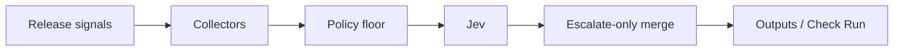

# JEV Release Oracle

[](https://github.com/JevForge/jev-release-oracle/releases)
[](LICENSE)
[](https://github.com/JevForge/jev-release-oracle/actions/workflows/ci.yml)

**Evaluate release risk** from commits, checks, vulnerabilities, incidents, and metrics. Jev recommends `proceed`, `warn`, `hold`, or `review`. A deterministic policy floor escalates only — never loosens — and the Action **never publishes releases or deploys**.

```yaml
- id: oracle
  uses: JevForge/jev-release-oracle@v0
  env:
    AI_GATEWAY_API_KEY: ${{ secrets.AI_GATEWAY_API_KEY }}
  with:
    base_ref: ${{ github.event.before }}
    signals_path: examples/signals.json
```

## Features

* Typed release gate powered by Jev (`experimental_evaluate`, not free-form generation)
* Decisions: `proceed` | `warn` | `hold` | `review` with escalate-only ranks
* Collectors for signals files, changelog, findings/SARIF, incidents, metrics, GitHub compare, checks, and deployments
* Deterministic policy floor from evidence; Jev may only raise severity
* `hold` always fails the job; `review` respects `review_mode`; `fail_on_warn` is opt-in
* Low-confidence policy: `fail` | `warn` | `request-review` | `no-op` (never fakes a trusted proceed)
* Optional PR comment, Check Run, report artifacts, and reviewer requests
* Effects allowlisted only — no publish/deploy side effects

## How it works



1. Collect evidence from files and optional GitHub APIs.
2. Compute a deterministic policy floor (`proceed` → `warn` → `review` → `hold`).
3. Ask Jev through `jev_provider` (no silent provider fallback).
4. Validate the typed answer; out-of-contract choices are rejected.
5. Merge with escalate-only ranking; apply confidence and source-error rails.
6. Emit outputs. Fail when `decision=hold`, or when review/warn policies require it.

## Quick start

1. Add repository secret `AI_GATEWAY_API_KEY`.
2. Provide signals (inline JSON, `signals_path`, and/or GitHub compare + checks).
3. Add a workflow (see [`examples/release-gate.yml`](examples/release-gate.yml)).

```yaml
name: Release gate
on:
  push:
    tags: ['v*.*.*']

permissions:
  contents: read
  checks: write

jobs:
  oracle:
    runs-on: ubuntu-latest
    steps:
      - uses: actions/checkout@v4
      - id: oracle
        uses: JevForge/jev-release-oracle@v0
        env:
          AI_GATEWAY_API_KEY: ${{ secrets.AI_GATEWAY_API_KEY }}
        with:
          environment: production
          signals_path: examples/signals.json
          metrics_path: examples/metrics.json
      - run: echo "decision=${{ steps.oracle.outputs.decision }}"
```

Pin `@v0` or a full commit SHA. Concrete versions live in the CHANGELOG and GitHub Releases.

## Inputs

| Input | Default | Description |
| --- | --- | --- |
| `target_ref` | `GITHUB_SHA` | Ref being released |
| `base_ref` | — | Previous ref for compare |
| `signals` / `signals_path` | — | Inline or file signals |
| `changelog_path` | — | Changelog / notes path |
| `findings_path` / `sarif_path` | — | Security findings |
| `incidents_path` / `metrics_path` | — | Incidents and SLO metrics |
| `fetch_github_compare` | `true` | Compare commits/PRs |
| `fetch_checks` | `true` | Load check runs |
| `fetch_deployments` | `false` | Load deployment statuses |
| `incident_labels` | `incident,sev1,sev2` | Incident label filter |
| `environment` | `production` | Target environment |
| `min_confidence` | `0.75` | Minimum Jev confidence |
| `low_confidence_policy` | `fail` | fail / warn / request-review / no-op |
| `review_mode` | `fail` | fail or continue on review |
| `fail_on_warn` | `false` | Fail workflow on warn |
| `source_error_policy` | `fail` | fail or warn on source errors |
| `jev_provider` | `vercel-ai-gateway` | Jev access path |
| `jev_endpoint` / `jev_model` | — | Native/custom provider settings |
| `timeout_ms` | `45000` | Jev timeout |
| `max_items_to_jev` | `40` | Sample size for Jev |
| `comment_on_github` | `false` | Upsert PR comment |
| `create_check_run` | `true` | Create Check Run |
| `write_report_artifact` | `false` | Write `.jev/` reports |
| `request_reviewers` | — | Comma-separated logins |
| `structured_logs` | `false` | JSON info log |
| `dry_run` | `false` | Skip mutating writes |
| `github_token` | `${{ github.token }}` | API token |

## Outputs

| Output | Description |
| --- | --- |
| `decision` | `proceed` / `warn` / `hold` / `review` |
| `confidence` | 0–1 |
| `reason_codes` | JSON array of stable codes |
| `risk_summary` | JSON risk counts |
| `recommended_checks` | Allowlisted follow-up checks |
| `held` | `true` when decision is hold |
| `provisional` | `true` when Jev was unusable |
| `jev_status` | evaluated / unavailable / schema_rejected |
| `jev_proposed` | Jev choice or empty |
| `policy_floor` | Deterministic floor |
| `summary` | One-line summary |
| `check_status` | created / dry-run / skipped |
| `report_markdown_file` / `report_json_file` | Artifact paths |

## Data sent to Jev

Sent (selected provider only):

* Environment, refs, policy floor, risk counts
* Check and deployment summaries, changelog flags
* A bounded sample of commits, findings, incidents, and metrics

Not sent:

* API tokens / secrets
* Raw SARIF blobs beyond the sampled finding metadata
* Free-form text as executable commands

## Security

* Paths must stay inside `GITHUB_WORKSPACE`
* Custom Jev endpoints must be HTTPS
* No silent fallback between Jev providers
* Explanation text is never executed
* Effects are allowlisted (`set-outputs`, comments, check runs, reviewers, fail/warn) — never publish or deploy

## Permissions

```yaml
permissions:
  contents: read          # compare commits when enabled
  checks: write           # create_check_run
  pull-requests: write    # comment_on_github / request_reviewers
  deployments: read       # fetch_deployments
```

## Dry run

Set `dry_run: true` to evaluate and emit outputs without posting comments, creating check runs, requesting reviewers, or writing report artifacts.

## Troubleshooting

| Symptom | Likely cause |
| --- | --- |
| `provisional=true`, job fails | Missing `AI_GATEWAY_API_KEY` / provider error with `low_confidence_policy=fail` |
| Floor is `hold` despite Jev `proceed` | Critical vuln, open sev1, failed required checks, or deploy failure |
| `SOURCE_UNAVAILABLE` | Missing signal file or GitHub API error with `source_error_policy=fail` |
| Schema rejected | Provider returned a choice outside `proceed\|warn\|hold\|review` |

## License

MIT © JevForge
