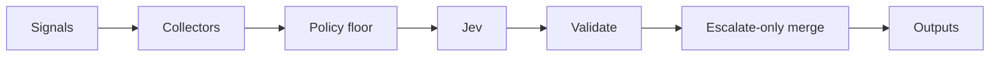

# JEV Release Oracle

[](https://github.com/JevForge/jev-release-oracle/releases)
[](LICENSE)
[](https://github.com/JevForge/jev-release-oracle/actions/workflows/ci.yml)

**Gate a release candidate before you tag or ship.** This Action aggregates commits, checks, vulnerabilities, incidents, and metrics, asks [TypeSafe Jev](https://vercel.com/ai-gateway/models/jev) for a typed recommendation (`proceed` / `warn` / `hold` / `review`), then applies a deterministic policy floor that can only get stricter.

It does **not** publish GitHub Releases or deploy anything. Your workflow stays in control of what happens next.

```yaml
- id: oracle
  uses: JevForge/jev-release-oracle@v0
  env:
    AI_GATEWAY_API_KEY: ${{ secrets.AI_GATEWAY_API_KEY }}
  with:
    base_ref: ${{ github.event.before }}
    signals_path: .jev/signals.json
    environment: production
```

Pin `@v0`, an exact tag such as `@v0.1.0`, or a commit SHA.

## Features

* Release risk gate from commits, checks, vulns, incidents, changelog, and SLO metrics
* Typed Jev evaluation (`experimental_evaluate`) — not free-form text generation
* Deterministic policy floor; Jev may escalate, never loosen a `hold`
* Decisions: `proceed` | `warn` | `hold` | `review`
* Collectors for signal files, SARIF/findings, GitHub compare, check runs, deployments, and release baselines
* Direct inputs from Security Sentinel and Cloud Cost Guardian outputs
* Structured outputs for later steps (`decision`, `held`, `risk_summary`, `recommended_checks`, …)
* Secret-based auth via env (never Action inputs)
* Configurable failure modes for low confidence and source errors
* Optional Check Run, PR comment, report artifacts, and reviewer requests
* Effects allowlisted only — never publish or deploy

## How it works

```text
Release signals / GitHub APIs
        ↓
Normalize + redact secrets
        ↓
Compute deterministic policy floor
        ↓
Jev proposes proceed | warn | hold | review
        ↓
Schema check + escalate-only merge
        ↓
Action outputs (+ optional Check Run / comment)
        ↓
Next CI/CD step
```



1. Load evidence from `.jev/config.yml`, inputs, files, sibling Action outputs, and optional GitHub APIs. Explicit inputs win over file configuration.
2. Compute a deterministic floor (`proceed` → `warn` → `review` → `hold`).
3. Call Jev through `jev_provider` (no silent provider fallback).
4. Reject invalid payloads; merge so the final decision is never weaker than the floor.
5. Emit outputs. Fail when `decision=hold`, or when review/warn policies require it.
6. Explanation text is display-only and never executed.

## Demo

```text
Tag push for v1.4.0
        ↓
Failed required checks + open sev1 incident
        ↓
Policy floor = hold
Jev proposed = warn (ignored as weaker)
        ↓
decision = hold
held = true
        ↓
Job fails — publish/deploy steps do not run
```

## Why Jev?

Jev is the **contextual judgment** layer for release go/hold. Thresholds alone cannot weigh failed checks, critical vulns, open incidents, breaking changes, and SLO breaches together. This Action sends a redacted sample and risk counts to Jev, receives a typed choice (`proceed` / `warn` / `hold` / `review`), then lets local policy enforce a floor.

Jev does **not** publish releases, create deployments, invent shell commands, or replace your scanners. If Jev is unavailable or below `min_confidence`, the result is marked `provisional` and `low_confidence_policy` applies — the Action never pretends a confident AI proceed happened.

## Quick Start

1. Add repository secret `AI_GATEWAY_API_KEY` (default Jev provider).
2. Provide signals (`signals` / `signals_path`) and/or enable GitHub compare + checks.
3. Add a workflow:

```yaml
name: Release gate
on:
  push:
    tags: ['v*.*.*']

permissions:
  contents: read
  checks: write

jobs:
  oracle:
    runs-on: ubuntu-latest
    steps:
      - uses: actions/checkout@v4

      - id: oracle
        uses: JevForge/jev-release-oracle@v0
        env:
          AI_GATEWAY_API_KEY: ${{ secrets.AI_GATEWAY_API_KEY }}
        with:
          environment: production
          fetch_github_compare: 'false'
          signals_path: examples/signals.json

      - name: Print decision
        if: always()
        run: |
          echo "decision=${{ steps.oracle.outputs.decision }}"
          echo "held=${{ steps.oracle.outputs.held }}"
          echo "floor=${{ steps.oracle.outputs.policy_floor }}"
```

## Complete Example

Gate a later job on the oracle decision:

```yaml
name: Release gate and publish
on:
  workflow_dispatch:

permissions:
  contents: read
  checks: write

jobs:
  gate:
    runs-on: ubuntu-latest
    outputs:
      decision: ${{ steps.oracle.outputs.decision }}
      held: ${{ steps.oracle.outputs.held }}
    steps:
      - uses: actions/checkout@v4
        with:
          fetch-depth: 0

      - id: oracle
        uses: JevForge/jev-release-oracle@v0
        env:
          AI_GATEWAY_API_KEY: ${{ secrets.AI_GATEWAY_API_KEY }}
        with:
          environment: production
          base_ref: ${{ inputs.base_ref }}
          signals_path: .jev/signals.json
          findings_path: .jev/findings.json
          metrics_path: .jev/metrics.json
          changelog_path: CHANGELOG.md
          create_check_run: 'true'
          review_mode: fail

  publish:
    needs: gate
    if: needs.gate.outputs.decision == 'proceed' || needs.gate.outputs.decision == 'warn'
    runs-on: ubuntu-latest
    steps:
      - run: echo "Safe to continue your own publish steps"
```

More workflows: [`examples/basic.yml`](examples/basic.yml), [`examples/release-gate.yml`](examples/release-gate.yml), [`examples/gate-and-publish.yml`](examples/gate-and-publish.yml), and [`examples/pr-pre-release.yml`](examples/pr-pre-release.yml).

## Repository configuration

The Action loads `.jev/config.yml` when present. Use the same snake_case names as the inputs; an explicitly supplied workflow input wins, including `false` and `0`. An example is [`examples/.jev/config.yml`](examples/.jev/config.yml).

For accepted release debt, set `baseline_mode: new_only`. The Action first uses `baseline_path` when supplied; otherwise it reads `.jev/release-oracle-report.json` from the previous stable GitHub release tag. Findings, incidents, and check failures remain visible, while the deterministic floor uses only the new delta.

Sibling outputs can be wired directly:

```yaml
with:
  sentinel_decision: ${{ steps.sentinel.outputs.decision }}
  findings: ${{ steps.sentinel.outputs.findings }}
  cost_decision: ${{ steps.cost.outputs.decision }}
  metrics: ${{ steps.cost.outputs.findings }}
```

## Inputs

| Input | Required | Default | Description |
| --- | --- | --- | --- |
| `target_ref` | no | `GITHUB_SHA` | Git ref or SHA being released |
| `base_ref` | no | — | Previous ref for compare |
| `signals` | no | — | Inline JSON release signals |
| `signals_path` | no | — | Workspace path to signals JSON/YAML |
| `changelog_path` | no | — | Path to CHANGELOG or release notes |
| `findings_path` | no | — | Path to security findings JSON |
| `sarif_path` | no | — | Path to SARIF findings |
| `incidents_path` | no | — | Path to incidents JSON |
| `metrics_path` | no | — | Path to SLO/metrics JSON |
| `fetch_github_compare` | no | `true` | Fetch commits/PRs between base and target |
| `fetch_checks` | no | `true` | Fetch check-run conclusions for target |
| `fetch_deployments` | no | `false` | Fetch deployment statuses |
| `incident_labels` | no | `incident,sev1,sev2` | Labels that mark incident issues |
| `environment` | no | `production` | `production` \| `staging` \| `development` \| `other` |
| `min_confidence` | no | `0.75` | Minimum Jev confidence before proceed can stand |
| `low_confidence_policy` | no | `fail` | `fail` \| `warn` \| `request-review` \| `no-op` |
| `review_mode` | no | `fail` | `fail` \| `continue` when decision is `review` |
| `fail_on_warn` | no | `false` | Fail the workflow when decision is `warn` |
| `source_error_policy` | no | `fail` | `fail` \| `warn` when a signal source fails |
| `jev_provider` | no | `vercel-ai-gateway` | `vercel-ai-gateway` \| `typesafe-native` \| `custom-compatible` |
| `jev_endpoint` | no | — | HTTPS evaluate endpoint (native/custom) |
| `jev_model` | no | — | Model id (gateway default: `typesafe-ai/jev`) |
| `timeout_ms` | no | `45000` | Jev request timeout |
| `max_items_to_jev` | no | `40` | Max evidence items sampled for Jev |
| `comment_on_github` | no | `false` | Upsert an idempotent PR comment |
| `create_check_run` | no | `true` | Create a completed Check Run |
| `write_report_artifact` | no | `false` | Write markdown/JSON under `.jev/` |
| `request_reviewers` | no | — | Comma-separated logins for hold/review |
| `structured_logs` | no | `false` | Emit a JSON info log (no secrets) |
| `dry_run` | no | `false` | Skip comment, check run, and reviewer writes |
| `github_token` | no | `${{ github.token }}` | Token for GitHub API reads/writes |

Paths must stay inside `GITHUB_WORKSPACE`. Provider credentials belong in `env`, not in `with:`.

Additional inputs for pipeline composition: `findings` and `metrics` accept inline JSON; `baseline_path` plus `baseline_mode: new_only` enables an explicit baseline; `sentinel_decision`, `sentinel_findings`, `cost_decision`, and `cost_metrics` accept sibling Action outputs directly.

## Outputs

`jev_error_code` is emitted when the provider is unavailable or rejects its response. Values distinguish missing secret, configuration, unauthorized (401), rate limited (429), timeout, generic HTTP/network error, and schema rejection.

| Output | Description |
| --- | --- |
| `decision` | Final `proceed` \| `warn` \| `hold` \| `review` |
| `confidence` | `0`–`1` |
| `reason_codes` | JSON array of stable reason codes |
| `risk_summary` | JSON object with release risk counts |
| `recommended_checks` | JSON array of allowlisted follow-up checks |
| `held` | `true` when decision is `hold` |
| `provisional` | `true` when Jev did not return a usable typed decision |
| `jev_status` | `evaluated` \| `unavailable` \| `schema_rejected` |
| `jev_proposed` | Jev choice, or empty when unavailable |
| `policy_floor` | Deterministic floor before Jev escalation |
| `summary` | One-line summary for logs |
| `check_status` | `created` \| `dry-run` \| `skipped` |
| `report_markdown_file` | Markdown report path when artifacts are enabled |
| `report_json_file` | JSON report path when artifacts are enabled |

### Using outputs in conditions

```yaml
- name: Continue only on proceed
  if: steps.oracle.outputs.decision == 'proceed'

- name: Soft-allow warnings
  if: contains(fromJSON('["proceed","warn"]'), steps.oracle.outputs.decision)

- name: Stop when held
  if: steps.oracle.outputs.held == 'true'
  run: echo "Release held — investigate recommended_checks"

- name: Require humans on review
  if: steps.oracle.outputs.decision == 'review'
  run: echo "Needs release review"
```

`hold` fails the step by default. Use `if: always()` on follow-up steps that must still print outputs after a failed gate.

## Authentication

Create secrets under **Settings → Secrets and variables → Actions → New repository secret**.

| Secret | When |
| --- | --- |
| `AI_GATEWAY_API_KEY` | Default `jev_provider: vercel-ai-gateway` |
| `TYPESAFE_API_KEY` | `jev_provider: typesafe-native` |
| `JEV_CUSTOM_API_KEY` | `jev_provider: custom-compatible` |

```yaml
env:
  AI_GATEWAY_API_KEY: ${{ secrets.AI_GATEWAY_API_KEY }}
```

Do not put API keys in `with:`. Providers never fall back to each other.

## Permissions

Minimum for local signals + Check Run:

```yaml
permissions:
  contents: read
  checks: write
```

| Extra permission | When |
| --- | --- |
| `pull-requests: write` | `comment_on_github: true` or `request_reviewers` |
| `deployments: read` | `fetch_deployments: true` |
| `checks: write` | `create_check_run: true` (default) |

## Decision model

Rank (escalate-only): `proceed(0)` < `warn(1)` < `review(2)` < `hold(3)`.

Typical floor rules from evidence:

* Critical vuln, open sev1 incident, failed required checks, or deploy failure → at least `hold`
* Breaking change without changelog → at least `review`
* High vulns, SLO breach, or many failed tests → at least `warn` (stricter in production)
* Source errors with `source_error_policy=fail` → at least `review`

| `low_confidence_policy` | Behavior |
| --- | --- |
| `fail` | At least `review`, job fails (`hold` floor still holds) |
| `warn` | At least `warn` |
| `request-review` | At least `review` |
| `no-op` | Deterministic floor only (explicitly not a Jev decision) |

`hold` always fails the job. `review` respects `review_mode`. `fail_on_warn` is opt-in.

Allowlisted `recommended_checks`: `rerun-failed-tests`, `security-review`, `changelog-review`, `incident-review`, `slo-review`, `manual-qa`, `canary-first`, `rollback-plan`.

Signal format: [docs/signal-schema.md](docs/signal-schema.md). Decision contract: [docs/decision-contract.md](docs/decision-contract.md).

## Data sent to Jev

Sent (selected provider only):

* Environment, refs, policy floor, risk counts
* Check and deployment summaries, changelog flags
* A bounded sample of commits, findings, incidents, and metrics (`max_items_to_jev`)

Not sent:

* API tokens / secrets
* Raw SARIF blobs beyond sampled finding metadata
* Free-form text as executable commands

Gateway requests use zero data retention when available. Custom endpoints must be HTTPS.

## Dry run

Set `dry_run: true` to evaluate and emit outputs without posting comments, creating check runs, or requesting reviewers.

## Troubleshooting

| Symptom | Likely cause |
| --- | --- |
| `provisional=true`, job fails | Missing credential / provider error with `low_confidence_policy=fail` |
| Floor is `hold` despite Jev `proceed` | Critical vuln, open sev1, failed required checks, or deploy failure |
| `SOURCE_UNAVAILABLE` | Missing signal file or GitHub API error with `source_error_policy=fail` |
| `SCHEMA_REJECTED` | Provider returned a choice outside `proceed\|warn\|hold\|review` |
| `JEV_UNAVAILABLE` | Timeout, HTTP error, or missing secret for the selected provider |

## Security

* Secrets are redacted before logs and Jev payloads
* Paths stay inside `GITHUB_WORKSPACE`
* Custom Jev endpoints must be HTTPS
* No silent fallback between Jev providers
* Explanation text is never executed as a command, path, or GitHub operation
* Allowed side effects: set outputs, fail/warn the step, optional comment / Check Run / reviewers

See [SECURITY.md](SECURITY.md).

## Versioning

```yaml
uses: JevForge/jev-release-oracle@v0      # floating major
uses: JevForge/jev-release-oracle@v0.1.0 # exact release
```

Prefer an exact tag or commit SHA for production workflows.

## Development

```bash
npm ci
npm test
npm run typecheck
npm run build
# or
npm run all
```

Node.js 24+. Consumers run `dist/index.js` and do not need `npm install`. Rebuild and commit `dist/` when the entrypoint changes.

## Contributing

See [CONTRIBUTING.md](CONTRIBUTING.md). Bug and feature templates live under `.github/ISSUE_TEMPLATE/`.

## License

MIT — [LICENSE](LICENSE).
